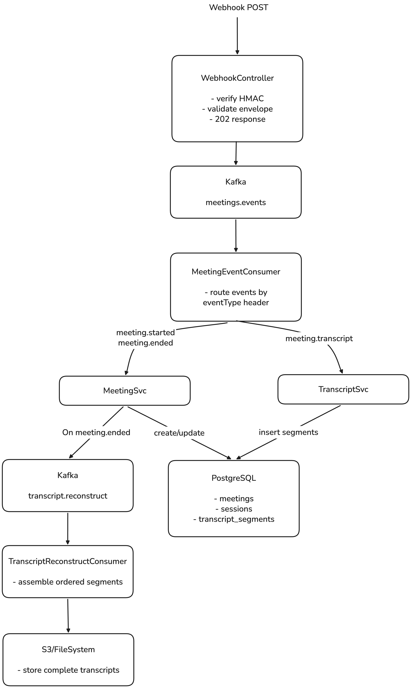
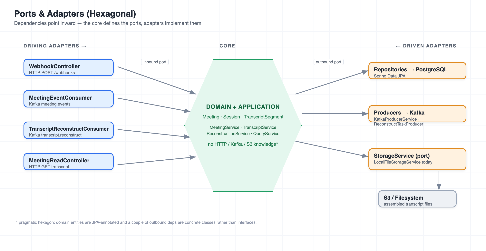

# Design Notes — Event-Driven Meeting Webhook Service

The deep-dive companion to the [`README`](README.md). It covers the architectural decisions and
their rationale.

## Architecture Overview

  

Failures in either consumer are retried with backoff by a `DefaultErrorHandler`, then routed to
a `<topic>.DLT` dead-letter topic.

**Read path:** `GET /api/v1/meetings/{id}/sessions/{sessionId}/transcript` →
`MeetingReadController` → `TranscriptQueryService` → ordered segments from PostgreSQL → JSON.

Business logic lives in services; controllers and consumers are thin adapters. Infrastructure
concerns (Kafka, HMAC, correlation IDs) are isolated from domain logic. The package layout is
documented in the README.

## Service Boundaries & Microservice Extraction

The app is a modular monolith today (simplest thing that works for the assignment), but it is
deliberately structured so it can be split into independently deployable services with minimal
change. The seams already exist because components communicate through Kafka topics and repository
interfaces, not in-process method calls across domains.

**Read vs write are separated on purpose.** Ingestion/processing (the write path) and the transcript
read API have very different access patterns and scaling needs:

| Concern | Write path | Read path |
| ------- | ---------- | --------- |
| Entry point | `WebhookController` → Kafka → consumers | `MeetingReadController` → query service |
| Load shape | Bursty, high-volume webhook fan-in | Spiky, read-heavy after meetings end |
| Bottleneck | Consumer throughput, DB writes | DB reads / cache |
| Scaling lever | More consumer instances / partitions | Read replicas, caching, CDN for files |
| Failure mode | Retries + DLQ (must not lose events) | Degradation is tolerable (retry the GET) |

Because the write side is fully asynchronous (202 + Kafka) and the read side only touches the DB,
they can scale — and fail — independently. This is a lean CQRS split: the same store, but distinct
entry points and models (`event`/`model` packages for writes, `dto` for reads).

**Natural microservice boundaries**, each already a package with its own topics/tables:

1. **Ingestion service** — `webhook` package. Stateless HTTP edge: verify HMAC, validate, publish to
   `meeting.events`. Scales horizontally with traffic; owns no database.
2. **Processing service** — `meeting` + `transcript` consumers. Consumes `meeting.events`, writes the
   domain tables, emits `transcript.reconstruct`. Scales with consumer concurrency / partitions.
3. **Reconstruction service** — `TranscriptReconstructConsumer` + `storage`. Consumes
   `transcript.reconstruct`, assembles files. CPU/IO-bound; scales independently of ingestion.
4. **Read/Query service** — `MeetingReadController` + `TranscriptQueryService`. Read-only; can run on
   read replicas and be scaled/cached separately.

**What makes extraction cheap here:** services already talk over Kafka (not shared method calls);
each has a clear input (topic or HTTP) and output (topic, DB, or file); the `StorageService` and
repository interfaces are ports that a split service keeps. The main work to extract would be
splitting the schema ownership and adding a shared event schema (registry) — not restructuring code.

We keep it a monolith now because the assignment is a locally runnable exercise and a single
deployable is easier to reason about; the boundaries are documented so the split is a deployment
decision, not a rewrite.

## Ports & Adapters

The code follows a ports-and-adapters (hexagonal) shape: transport and infrastructure sit at the
edges, the domain/application logic sits in the core, and dependencies point inward.

- **Driving adapters** (initiate work): `WebhookController`, `MeetingReadController` (HTTP) and
  `MeetingEventConsumer`, `TranscriptReconstructConsumer` (Kafka). They translate transport into
  core calls.
- **Core**: the domain (`Meeting`, `Session`, `TranscriptSegment`) plus the application services
  (`MeetingService`, `TranscriptService`, `TranscriptReconstructionService`, `TranscriptQueryService`).
- **Driven adapters** (the core reaches out to): repositories → PostgreSQL, producers → Kafka, and
  `StorageService` → filesystem/S3. `StorageService` is the cleanest port — a core interface whose
  backend swaps (local file today, S3 presigned URLs later) with no change to reconstruction.

**Honest caveat — pragmatic, not purist.** The domain entities are JPA-annotated and a couple of
outbound dependencies (`KafkaProducerService`, `ReconstructTaskProducer`) are concrete classes rather
than core-owned interfaces. A strict hexagon would keep the domain framework-free and depend only on
outbound port interfaces. We accepted that coupling to avoid a persistence-mapping layer for an
exercise of this size; the boundaries are still clear enough to extract later.

## Domain Model

- **Meeting** (1) → (\*) **Session** (1) → (*) **TranscriptSegment**.
- `Session.status` ∈ {`LIVE`, `ENDED`} (enum stored as string, plus a DB CHECK constraint).
- `TranscriptSegment` carries `transcriptId` (natural dedup key, `UNIQUE`), `sequenceNumber`
  (ordering), speaker id/name, content, offsets (integer seconds), language.
- Index on `transcript_segments(session_id, sequence_number)` supports ordered reconstruction.
- `Session.transcriptUri` records where the assembled transcript was stored (set on reconstruction).

### Offsets

`startOffset`/`endOffset` are stored as **integer seconds** relative to session start. The upstream
payload is inconsistent — the assignment text describes plain seconds (`"300"`) while the sample
script sends clock offsets (`"00:00:02.100"`). `OffsetParser` accepts both forms and normalizes to
truncated whole seconds, so the DB stays a clean numeric type regardless of input format.

### Lombok on entities

Entities use `@Getter/@Setter/@Builder/@NoArgsConstructor/@AllArgsConstructor` but **not**
`@Data`/`@EqualsAndHashCode`. `equals`/`hashCode` over lazy JPA associations is a well-known
footgun (can trigger lazy loading or infinite recursion), so it is deliberately avoided.

## Event-Driven Design

- **Why Kafka:** the assignment is explicitly event-driven. Kafka gives durable, replayable,
  partition-ordered delivery. Keying every event by `sessionId` guarantees all events for a
  session land on one partition and are processed in order — critical for transcript sequencing
  and for the started→transcript→ended lifecycle.
- **Producer keeps it thin:** the webhook publishes the *raw* JSON body verbatim (keyed by
  sessionId) with `eventType` and `correlationId` headers. Per-event deserialization happens in
  the consumer. This keeps ingestion fast and decouples the HTTP layer from event schemas.
- **At-least-once + idempotency:** Kafka is at-least-once, so every handler is idempotent
  (see below). Duplicates are expected and safe.
- **Swapping the broker:** because publishing goes through a small `KafkaProducerService` and
  consumption through `@KafkaListener`, moving to a managed Kafka / another broker is a config
  change, not a code rewrite.

## Idempotency & Ordering

| Event              | Idempotency strategy                                                        |
| ------------------ | --------------------------------------------------------------------------- |
| `meeting.started`  | Upsert Meeting; create Session only if `existsById(sessionId)` is false.    |
| `meeting.transcript` | Skip if `existsByTranscriptId`; DB `UNIQUE(transcript_id)` is the race backstop. |
| `meeting.ended`    | No-op if session already `ENDED`.                                           |

Ordering is by `sequenceNumber` at read time, so out-of-order delivery still reconstructs
correctly. Partition keying by sessionId makes out-of-order delivery rare in practice.

### No transactional outbox — natural-key idempotency instead

We deliberately did **not** implement a transactional outbox. The outbox pattern exists to make the
DB write and the event publish atomic (avoiding dual-write inconsistency). We don't need it here
because the flow is inverted and idempotent by natural key:

Kafka supports messages up to ~1 MB by default, and we assume text-only transcript segments fit
comfortably within that limit. So we can forward the payload straight through Kafka rather than
staging it in the DB first and publishing an event separately — which is exactly the dual-write an
outbox would be needed to coordinate.

- On ingestion the webhook only publishes to Kafka; there is **no DB write on the produce side**, so
  there is no dual-write to keep atomic.
- On the consume side, processing is driven by the event and made safe by natural dedup keys:
  `transcriptId` for transcript segments (unique constraint) and `sessionId` for sessions
  (`existsById`). Re-processing the same Kafka record — the classic at-least-once redelivery — is a
  no-op, so we don't need exactly-once/outbox machinery.
- `meeting.ended` triggers a second publish (`transcript.reconstruct`) *after* its DB commit. If the
  process dies between commit and publish, the reconstruct task is lost — but this is recoverable and
  low-stakes: reconstruction is idempotent (it just re-reads segments) and can be re-triggered, and
  the transcript is always still available from the DB via the read API. That residual risk is the
  conscious trade-off for not adding an outbox.

**Trade-off:** natural-key idempotency is simpler and has no extra table/relay to operate, but it
relies on every message carrying a stable dedup key (which the payloads do: `transcriptId`,
`sessionId`). If we later needed guaranteed delivery of the reconstruct task specifically, an outbox
(or Kafka transactions) on that single hop would be the upgrade path.

## Error Handling & Retries

- `DefaultErrorHandler` + `ExponentialBackOff` (prod defaults 1s → 5s → 30s, 3 attempts;
  configurable via `app.kafka.retry.*`; tests use 200ms ×2 for speed).
- `DeadLetterPublishingRecoverer` routes exhausted records to `<topic>.DLT`.
- **Retryable vs not:** transient/ordering failures (e.g. `UnknownSessionException` — a
  transcript/ended event that arrived before its session committed) are retried. Structural
  failures (`MismatchedInputException`, `IllegalArgumentException` — malformed payloads) are
  marked non-retryable and dead-lettered immediately, since retrying will never help.
- **Fail-fast validation in handlers:** `MeetingService`/`TranscriptService` validate required
  fields (`meeting.sessionId`, `data.transcriptId`, `sequenceNumber`, `content`, offsets, etc.)
  at the top of each handler and throw `IllegalArgumentException` with a specific message. This
  mirrors the up-front envelope validation in the webhook controller. Without it, a null field
  would surface as an opaque `NullPointerException` — which is *not* in the non-retryable set — so
  a single malformed message would burn the entire retry budget before dead-lettering with an
  unhelpful cause. Failing fast dead-letters promptly with a clear reason.
- **DLQ triage:** the recoverer unwraps the listener wrapper to the root cause and logs its type +
  message (e.g. `IllegalArgumentException: Transcript event missing data`) alongside the
  topic/partition/offset, so dead-lettered records are diagnosable from logs alone.

## Security

- **HMAC-SHA256** over the raw request body, compared in constant time (`MessageDigest.isEqual`).
- **Fail-closed:** when verification is enabled, a missing or invalid signature returns 401.
  Verification is toggleable (`app.webhook.signature-verification-enabled`) and disabled in the
  `local`/`test` profiles so the provided simulation script (which sends no signature) works.
- The HMAC secret is externalized via config/env, never hard-coded.

## Transcript Storage & Reconstruction

- When a session ends, `MeetingService` publishes a task to `transcript.reconstruct` (keyed by
  sessionId). `TranscriptReconstructConsumer` picks it up and delegates to
  `TranscriptReconstructionService`, which loads segments in `sequenceNumber` order, formats them,
  stores the result, and records the URI on the session.
- **Format:** one line per segment — `[start-end s] Speaker: content` — plain, human-readable text.
- **StorageService abstraction:** `store`/`retrieve` are behind an interface. `LocalFileStorageService`
  writes `{basePath}/{sessionId}.txt`. Swapping in S3/GCS is a new implementation, no change to
  reconstruction logic. The URI (not the blob) is what's persisted on the session, so the read API
  can fetch on demand.

### Storage evolution (local files → object store)

`LocalFileStorageService` is a stand-in that simulates durable object storage on the local
filesystem so the project runs with zero external dependencies. Because everything goes through the
`StorageService` port (`store(sessionId, content) → uri`, `retrieve(sessionId)`), the local impl can
be swapped for a cloud object store without touching reconstruction, the read API, or the domain:

- **S3 (or GCS/Azure Blob).** An `S3StorageService` uploads to `s3://{bucket}/{sessionId}.txt` and
  returns the object URI, which is stored on the session exactly as today. Selected by profile/config
  (e.g. `app.storage.provider=s3`), so no code path changes.
- **Encryption at rest.** Enable bucket-level SSE (SSE-S3 or SSE-KMS) so transcripts — which contain
  meeting speech — are encrypted transparently. The service just sets the encryption header/option; no
  application-level key handling.
- **Compression.** Transcripts are highly compressible text; gzip before upload (store as
  `{sessionId}.txt.gz`) to cut storage and transfer cost. Compression/decompression is internal to the
  storage impl, invisible to callers.
- **Why this is a clean seam:** the session persists only the URI, and the read API sources structured
  entries from the DB — so object storage is purely for the assembled artifact. Latency, durability,
  and cost characteristics change with the backend, but the contract does not.
- **Reconstruction as its own event/consumer** (rather than inline in the `meeting.ended` handler)
  keeps the DB write for ending a session fast, isolates the file I/O, and lets reconstruction retry
  independently. Failures flow through the same `DefaultErrorHandler` to `transcript.reconstruct.DLT`.
- **Empty transcript decision:** if a session ends with zero segments, an empty transcript file is
  still written (rather than failing/looping). This is a terminal, deterministic outcome; a meeting
  legitimately may have had no speech.

### Why reconstruct *after* `meeting.ended` (and completeness)

Reconstruction is triggered by `meeting.ended`, not incrementally per transcript. Assembling only
once the session is closed means we have the full set of segments in hand and don't rewrite the file
on every chunk. It also sidesteps needing to know the total segment count *up front* — we simply read
whatever is in the DB, ordered by `sequenceNumber`.

**Completeness / how many segments there should be.** The webhook payloads carry a per-chunk
`sequenceNumber` but **no total count**, so "did we get everything?" is not answerable from a single
event. Two ways to make completeness checkable, in order of preference:

1. **Sequence-gap detection at reconstruction time.** Since segments are ordered by `sequenceNumber`,
   a gap (e.g. 1, 2, 4) or a missing head means a chunk never arrived. This check has a natural home
   in `TranscriptReconstructionService` and needs no schema change — it can log a warning, tag a
   metric, or mark the session `INCOMPLETE`. (Not enabled by default because a legitimate stream may
   not start at 1.)
2. **Explicit total on the closing event.** If upstream added a `totalSegments` (or
   `expectedSequenceCount`) field to `meeting.ended`, we would persist it on the session and compare
   against the stored count during reconstruction — a definitive completeness signal.

We rely on **at-least-once delivery from the client**: the platform is assumed to retry until each
webhook is accepted, so every segment eventually arrives (possibly duplicated, which we dedup). Under
that assumption, missing segments are transient and covered by the client's retries; gap detection is
the safety net for the rare permanent loss. We did not add a speculative `totalSegments` column
because no field in the current contract feeds it — adding an always-null column would be misleading.

### Known gap: lost reconstruct task / incomplete file (self-healing)

Two failure modes leave the stored file missing or stale, neither yet mitigated:

1. **Lost task** — if the process dies between committing `ENDED` and publishing the
   `transcript.reconstruct` task, the file is never written (the no-outbox trade-off).
2. **Incomplete reconstruction** — a late transcript that arrives *after* `meeting.ended` is stored
   in the DB but not folded into the already-written file.

**Self-heal (planned):** make the read path repair on demand. When a session is `ENDED` but
`transcriptUri` is null (lost task) or the file's segment count is stale versus the DB count
(incomplete), (re)publish a `transcript.reconstruct` task and serve the DB-sourced transcript in the
meantime. Reconstruction is already idempotent (re-reads segments, overwrites the file), so requeuing
is always safe. A periodic sweeper over `ENDED` sessions with a null `transcriptUri` would catch cases
that are never read. The DB stays the source of truth, so readers are always correct even before the
file heals.

## Read API

- **Endpoint:** `GET /api/v1/meetings/{meetingId}/sessions/{sessionId}/transcript`.
- **Ownership check:** the session must exist *and* belong to the given meeting
  (`findByIdAndMeetingId`); otherwise 404 with a meaningful message. This prevents leaking a valid
  session under the wrong meeting id.
- **Source of truth is the DB, not the file.** The structured `entries` are always loaded from
  `transcript_segments` ordered by `sequenceNumber`. This works uniformly whether the session is
  LIVE (still accumulating; no file yet) or ENDED (already reconstructed). The stored artifact's
  `transcriptUri` is included as a reference for consumers that want the assembled text file, but
  the API does not reverse-parse that file — round-tripping a denormalized artifact back into
  structured data would be fragile and redundant.
- **Response shape:** session metadata (meeting id/title, status, started/ended, transcriptUri,
  segment count) plus an ordered list of entries (sequenceNumber, speaker id/name, content,
  start/end offset seconds, language). Records/DTOs keep the domain entities out of the HTTP layer.
- **Pagination** is deferred — sessions hold a bounded number of segments at current scale. If
  needed, the ordered query already supports it via a `Pageable` overload.

### Splitting the response (URL vs full transcript)

Today the endpoint returns metadata + `transcriptUri` + the full `entries[]` inline. That's simplest
and always correct (entries come from the DB), but it doesn't scale for long meetings. A
business-driven tiered contract would be:

- **ENDED + file ready** → return metadata + a **presigned S3 URL** and let the client download the
  blob directly, offloading bandwidth from the app (URL-first).
- **ENDED + file missing/stale** → trigger the self-heal above and serve DB-sourced `entries[]` as the
  fallback.
- **LIVE (no file yet)** → serve DB-sourced `entries[]`, paginated.

So `entries[]` becomes the fallback/streaming path and the URL becomes the primary for completed
sessions — chosen per requirement (e.g. a UI that renders inline vs. a client that just downloads).

## Observability

- **Correlation IDs:** `CorrelationIdFilter` mints/propagates `X-Correlation-Id` into the MDC and
  echoes it on responses; the producer copies it into a Kafka header; the consumer restores it to
  the MDC. This threads one id across HTTP → Kafka → processing for traceable logs.
- **Structured logging:** uses Spring Boot's native structured logging
  (`logging.structured.format.console`, opt-in via `LOG_FORMAT=ecs`) rather than adding
  logstash-logback-encoder — one fewer dependency, and MDC values are included automatically. The
  consumer puts `sessionId` and `event` into the MDC (alongside `correlationId`) so each log line is
  attributable to a session and event type. Local/dev keeps the readable plain-text pattern.
- **Custom metrics (Micrometer → Prometheus):**
  | Metric | Type | Tags | Meaning |
  | ------ | ---- | ---- | ------- |
  | `webhook.events.received` | counter | `event` | events accepted at the HTTP edge |
  | `consumer.events.processed` | counter | `event`, `outcome` | consumed events, success/failure |
  | `consumer.event.processing.time` | timer | `event` | per-event processing latency |
  | `transcript.reconstruction.count` | counter | — | transcripts assembled |
  | `kafka.consumer.dlq.count` | counter | `topic`, `cause` | records dead-lettered |
- Metric names/tags are centralized in `common/Metrics` so instrumentation stays consistent.
- Actuator exposes health, info, metrics, and Prometheus; Grafana is provisioned via Docker Compose
  with a fixed-uid Prometheus datasource and a **Meeting Webhook Service** dashboard (event rates,
  processing outcome, p95 latency, reconstruction total, DLQ rate).

## Edge Case Behavior

Explicit, tested decisions for scenarios beyond the happy path. Each row is covered by a test
(unit or integration) and, where runnable end-to-end, by `scripts/simulate_edge_cases.sh`.

| Scenario | Behavior | Rationale |
| -------- | -------- | --------- |
| **Duplicate transcript chunk** (same `transcriptId`) | Stored once; second delivery is a no-op | `existsByTranscriptId` dedup + `UNIQUE(transcript_id)` backstop. At-least-once delivery must be safe. |
| **Out-of-order transcript delivery** | All stored; read/reconstruction order by `sequenceNumber` | Ordering is a read-time concern; arrival order is irrelevant. |
| **Duplicate `meeting.started`** | Meeting metadata refreshed; session created only once | Idempotent upsert; `existsById(sessionId)` guards session creation. |
| **Duplicate/replayed `meeting.ended`** | No-op if session already ENDED | Terminal state; avoids re-triggering reconstruction. |
| **Transcript after `meeting.ended`** | Still persisted; session stays ENDED; visible via GET; **not** auto-re-assembled into the stored file | No data loss. The DB is the source of truth for the read API; re-assembling the file on every late segment would be wasteful. A re-reconstruction trigger could be added if needed. |
| **`meeting.ended` without `meeting.started`** | `UnknownSessionException` → retried with backoff → DLQ | The started event may be briefly in flight (retry covers it); a truly orphaned end is dead-lettered rather than silently dropped. |
| **Transcript before its `meeting.started`** | Same as above — retried, then DLQ if the session never appears | Keyed-by-session ordering makes this rare; retry covers transient lag. |
| **Concurrent sessions, same meeting** | Tracked independently — separate segments and lifecycle under one Meeting | Matches the domain model (Meeting 1→* Session); sessionId is the unit of isolation. |
| **Malformed payload (null `data`/fields)** | 202 at the edge; consumer fails fast with non-retryable `IllegalArgumentException` → immediate DLQ | Webhook accepts quickly (async contract); structural errors never succeed on retry, so they skip the retry budget. |
| **Malformed JSON at the webhook** | 400 with a meaningful message | Caught synchronously before publishing; nothing enters the pipeline. |
| **Missing/invalid HMAC signature** (when enabled) | 401, fail-closed | Security boundary is at ingestion. |
| **Consumer failure (transient)** | Retried with exponential backoff, then DLQ | Bounded retries prevent poison-pill loops. |

## Design Patterns

Patterns used, and where:

- **Ports & Adapters (Hexagonal).** Transport/infra at the edges, domain in the core. See the
  dedicated section above.
- **Ports / Strategy — `StorageService`.** An interface (`store`/`retrieve`) with a swappable
  implementation (`LocalFileStorageService` now, `S3StorageService` later). The core depends on the
  port, not the backend.
- **Adapter.** `WebhookController`, `MeetingEventConsumer`, `TranscriptReconstructConsumer`, and
  `MeetingReadController` adapt HTTP/Kafka transport into core service calls.
- **Publish/Subscribe (event-driven).** The webhook publishes to Kafka; consumers subscribe and act.
  Producer and consumer are decoupled by the topic.
- **Repository.** Spring Data repositories (`MeetingRepository`, `SessionRepository`,
  `TranscriptSegmentRepository`) abstract persistence from the services.
- **Builder.** Lombok `@Builder` on entities for readable, immutable-style construction.
- **DTO.** Request/response records (`WebhookEnvelope`, `TranscriptResponse`, `TranscriptEntry`,
  event records) keep JPA entities out of the transport layer.
- **Idempotent Receiver.** Every handler dedups on a natural key (`transcriptId` / `sessionId`) so
  at-least-once redelivery is safe.
- **Dead Letter Channel.** `DeadLetterPublishingRecoverer` routes exhausted/poison messages to
  `<topic>.DLT`.
- **Correlation Identifier.** `CorrelationIdFilter` threads `X-Correlation-Id` across HTTP → Kafka →
  consumer for end-to-end tracing.
- **Externalized Configuration.** `@ConfigurationProperties` (`AppProperties`) binds `app.*` settings
  with validation.

## What We Did (and Didn't)

### Application Code Design

- Idiomatic Spring Boot: constructor injection, `@Service`/`@RestController`/`@KafkaListener`, records
  for DTOs, Lombok for entity boilerplate.
- **Package-by-feature** (`webhook`, `meeting`, `transcript`, `storage`, `common`) rather than
  package-by-layer, so the structure reflects the domain. Meaningful names throughout.
- Small, single-responsibility services; thin controllers/consumers; Javadoc on public types.
- **Not done:** no custom framework abstractions beyond what's needed; entities double as JPA models
  (no separate domain/persistence mapping) — a deliberate simplification.

### Separation of Concerns

- Clear layers **within each feature slice**: adapter (controller/consumer) → service (business
  logic) → repository/port (infrastructure). Business logic never lives in controllers.
- Infrastructure concerns are isolated: HMAC verification, correlation IDs, Kafka wiring, and error
  handling live in `webhook/security`, `common`, and `common/config` — out of the domain services.
- Storage is behind a port so the domain has no filesystem/S3 knowledge.
- **Read vs write** are separated (distinct entry points and models), a lean CQRS split.

### Scalability & Performance

- **Async by design.** The webhook returns `202 Accepted` immediately after publishing to Kafka; all
  processing is off the request thread. The HTTP edge stays fast and thin.
- **Horizontal scaling.** The ingestion edge is stateless and scales behind a load balancer. Consumers
  scale out by adding instances in the same consumer group up to the partition count — Kafka
  rebalances partitions across them.
- **Ordering preserved under scale.** Keying by `sessionId` keeps each session on one partition, so
  per-session order holds even with many consumer instances.
- **Back-pressure.** Kafka is the buffer — a burst of webhooks is absorbed by the log and drained at
  the consumers' pace, so a spike never overwhelms the DB. Consumer `max.poll.records` / concurrency
  are the tuning levers.
- **Connection pooling.** HikariCP (Spring Boot default) pools DB connections; sized via
  `spring.datasource.hikari.*` (10 max / 2 idle locally).
- **Future split to microservices.** The four boundaries (ingestion / processing / reconstruction /
  read) are already decoupled over Kafka topics and ports, so each can become an independently scaled
  service without a rewrite — reconstruction (IO-bound) and read (read-replica-friendly) scale on
  different axes from ingestion.
- **Read scaling.** Reads only touch the DB and can move to read replicas / caching independently.
- **Not done (deferred, documented):** consumer concurrency tuning, read replicas/caching, pagination
  on the read endpoint, and moving transcripts to S3. These are future-work items, not present today.

### Event-Driven Architecture

- **Why events, not just a publisher:** Kafka gives durable, replayable, partition-ordered delivery.
  The webhook and the DB writers are decoupled — ingestion can accept traffic even if a downstream
  consumer is slow or briefly down, and events can be replayed.
- **Where EDA adds value here:** the started → transcript → ended lifecycle maps naturally to ordered
  events; reconstruction is its own event (`transcript.reconstruct`) so it retries independently of
  the write that triggered it.
- **At-least-once + idempotent consumers** rather than chasing exactly-once — simpler and sufficient
  given natural dedup keys.
- **DLQ** for poison/exhausted messages so a bad event never blocks the partition.
- **Broker-agnostic seams:** publish via `KafkaProducerService`, consume via `@KafkaListener`, so the
  broker can be swapped by configuration.

### Design Considerations

- **Error handling:** exponential backoff, retryable-vs-non-retryable classification, fail-fast
  validation in handlers, and DLQ with root-cause logging (see Error Handling & Retries).
- **Idempotency:** natural-key dedup at the app layer plus a DB unique constraint as the atomic
  backstop (see Idempotency & Ordering).
- **Retry logic:** bounded `ExponentialBackOff`, configurable via `app.kafka.retry.*`.
- **Logging & observability:** correlation IDs, opt-in structured JSON logging, custom Micrometer
  metrics, Prometheus + Grafana (see Observability).
- **Configuration management:** externalized `@ConfigurationProperties`, profile-based
  (`local`/`test`), secrets via env vars, HMAC fail-closed in production.
- **Testing strategy:** unit + integration (embedded Kafka + H2) covering the failure modes — detailed
  in the README's Testing section.
- **Security:** HMAC-SHA256 signature verification (fail-closed), constant-time comparison.
- **Not done (deferred, documented):** transactional outbox, schema registry for typed events,
  external secret manager, and the self-healing reconstruction / tiered read response noted above.
