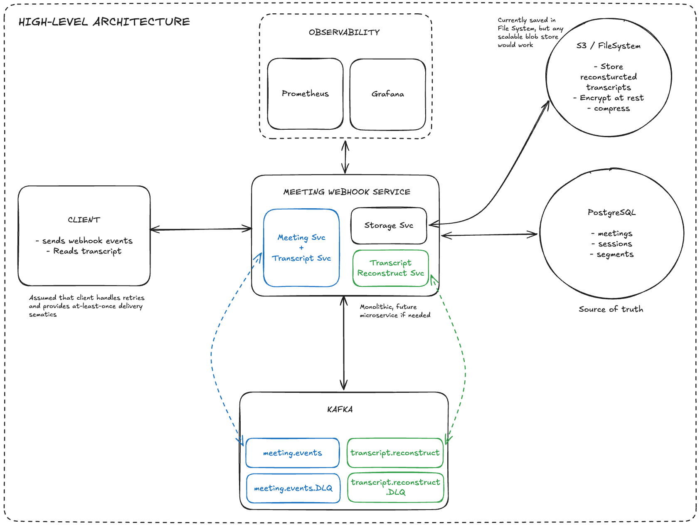

# Meeting Webhook Service

An event-driven webhook ingestion service for a video meeting platform, built with Java 17 and
Spring Boot 4. It receives meeting lifecycle and live-transcription webhooks, processes them
asynchronously through Kafka, persists the results to PostgreSQL, reconstructs the full transcript
when a meeting ends, and exposes a read API to retrieve the ordered transcript for a session.

> Design rationale, trade-offs, and per-decision detail live in [`DESIGN.md`](DESIGN.md).

---

## Contents

- [Architecture](#architecture)
- [Tech stack](#tech-stack)
- [Quick start](#quick-start)
- [API reference](#api-reference)
- [Testing UI](#testing-ui)
- [Simulation scripts](#simulation-scripts)
- [Configuration](#configuration)
- [Observability](#observability)
- [Testing](#testing)
- [Edge-case behavior](#edge-case-behavior)
- [Trade-offs & assumptions](#trade-offs--assumptions)
- [Future work](#future-work)

---

## Architecture



### Edge-case sequences

One sequence diagram per scenario (see [`DESIGN.md`](DESIGN.md) for the rationale):

- [Happy-path sequence diagram](docs/sequence-happy-path.png)
- [Duplicate transcript chunk](docs/sequence-duplicate-transcript.png) — same `transcriptId` twice → stored once
- [Out-of-order delivery](docs/sequence-out-of-order.png) — seq 3, 1, 2 → ordered on read
- [Transcript after `meeting.ended`](docs/sequence-transcript-after-ended.png) — still stored, session stays ENDED
- [`meeting.ended` without `meeting.started`](docs/sequence-ended-without-started.png) — retried, then dead-lettered
- [Concurrent sessions, same meeting](docs/sequence-concurrent-sessions.png) — tracked independently

**Key ideas**

- **Thin, fast ingestion.** The webhook verifies the signature over the raw bytes, does minimal
  envelope validation, and publishes the raw JSON to Kafka keyed by `sessionId`, then returns
  `202 Accepted`. All real work happens asynchronously in consumers.
- **Ordering by partition key.** Keying every event by `sessionId` guarantees per-session ordering
  on a single partition — important for the started → transcript → ended lifecycle.
- **Idempotent handlers.** Kafka is at-least-once, so every handler tolerates duplicates
  (session `existsById`, transcript `transcriptId` dedup + unique constraint, ENDED no-op).
- **Reconstruction as its own event.** Ending a session publishes a `transcript.reconstruct` task,
  keeping the DB write fast and letting assembly retry independently.
- **Pluggable storage.** `StorageService` abstracts where transcripts are written; the local
  implementation uses files, and an object store could drop in without touching reconstruction.

Layering: `webhook` (ingestion) · `meeting` (meeting/session domain) · `transcript` (segments,
reconstruction, read API) · `storage` (persistence abstraction) · `common` (cross-cutting).

---

## Tech stack

| Concern      | Choice                                               |
| ------------ | ---------------------------------------------------- |
| Language     | Java 17                                              |
| Framework    | Spring Boot 4.1.0 (Spring Framework 7)               |
| Build        | Maven (via the included wrapper `./mvnw`)            |
| Messaging    | Apache Kafka (KRaft mode — no Zookeeper)             |
| Database     | PostgreSQL 16 (H2 in tests)                          |
| Migrations   | Flyway                                               |
| Boilerplate  | Lombok 1.18.46                                        |
| Observability| Actuator + Micrometer/Prometheus + Grafana           |
| Tests        | JUnit 5, Mockito, Spring Kafka Test (embedded), Awaitility |

---

## Quick start

Requires **Docker** + **Docker Compose**. Everything else (JDK, Maven, Kafka, Postgres) is either
provided by the wrapper or the containers.

```bash
# Build the app image and start the full stack (Postgres, Kafka, Kafka UI, Prometheus, Grafana, app)
docker compose up --build
```

Wait for the app to report healthy, then:

```bash
# Drive a full meeting lifecycle and print the verify command
./scripts/simulate_meeting.sh

# Retrieve the reconstructed transcript
curl -s http://localhost:8080/api/v1/meetings/50c8940e-1b97-402a-97d6-2708b7feca41/sessions/05e57591-d89e-45c9-ae44-08dc1eaad0e0/transcript | jq .
```

Or open the browser testing UI at <http://localhost:8080/webhook-tester.html>.

### Service endpoints

| Service     | URL                                   | Notes                          |
| ----------- | ------------------------------------- | ------------------------------ |
| Application | <http://localhost:8080>               | REST API + testing UI          |
| Health      | <http://localhost:8080/actuator/health> |                              |
| Prometheus metrics | <http://localhost:8080/actuator/prometheus> |                     |
| Kafka UI    | <http://localhost:8090>               | topics, messages, DLQ          |
| Prometheus  | <http://localhost:9090>               | targets, queries               |
| Grafana     | <http://localhost:3000>               | "Meeting Webhook Service" dashboard (anonymous view enabled) |

### Running the app on the host (without the app container)

Start only the infrastructure, then run the app with the wrapper:

```bash
docker compose up postgres kafka kafka-ui
./mvnw spring-boot:run -Dspring-boot.run.profiles=local
```

The `local` profile points at `localhost:5432` (Postgres) and `localhost:29092` (Kafka's external
listener) and disables HMAC verification for convenience.

---

## API reference

### `POST /api/v1/webhooks`

Accepts `meeting.started`, `meeting.transcript`, and `meeting.ended` events (routed by the `event`
field). Returns **202 Accepted** on success.

- **400** — malformed JSON or missing required envelope fields (`event`, `meeting.id`,
  `meeting.sessionId`).
- **401** — missing/invalid `X-Signature` when HMAC verification is enabled (fail-closed).

Example (`meeting.started`):

```json
{
  "event": "meeting.started",
  "meeting": {
    "id": "50c8940e-1b97-402a-97d6-2708b7feca41",
    "sessionId": "05e57591-d89e-45c9-ae44-08dc1eaad0e0",
    "title": "Q4 Planning Sync",
    "startedAt": "2024-12-13T06:57:09.736Z",
    "createdAt": "2024-12-13T06:57:09.736Z",
    "organizedBy": { "id": "70c5d391-5bca-4cf3-9907-bec205798adb", "name": "Alice" }
  }
}
```

Transcript `data.startOffset` / `data.endOffset` are **relative seconds** from session start. Both
plain seconds (`"300"`) and clock offsets (`"00:05:00"`) are accepted and normalized to whole seconds.

### `GET /api/v1/meetings/{meetingId}/sessions/{sessionId}/transcript`

Returns the complete, ordered transcript plus session metadata. **404** if the meeting/session pair
is unknown. Works for both LIVE (still accumulating) and ENDED (reconstructed) sessions.

```json
{
  "meetingId": "…", "meetingTitle": "Q4 Planning Sync",
  "sessionId": "…", "status": "ENDED",
  "startedAt": "…", "endedAt": "…",
  "transcriptUri": "file:///…/{sessionId}.txt",
  "segmentCount": 3,
  "entries": [
    { "sequenceNumber": 1, "speakerId": "…", "speakerName": "Alice",
      "content": "…", "startOffsetSeconds": 2, "endOffsetSeconds": 5, "language": "en" }
  ]
}
```

---

## Testing UI

A single-page tester is served at **`/webhook-tester.html`**. It provides:

- **Full session simulation** — one click runs `meeting.started` → N transcripts → `meeting.ended`,
  then polls the GET endpoint and shows the reconstructed transcript.
- **Edge case scenarios** — six buttons mirroring `scripts/simulate_edge_cases.sh` (duplicate chunk,
  out-of-order, transcript-after-ended, ended-without-started, concurrent sessions, malformed payload).
- **Manual single-event tester** — send any hand-edited payload to the webhook.

---

## Simulation scripts

| Script                              | Purpose                                                        |
| ----------------------------------- | -------------------------------------------------------------- |
| `scripts/simulate_meeting.sh`       | Happy-path lifecycle (started → 3 transcripts → ended).        |
| `scripts/simulate_edge_cases.sh`    | Six edge-case scenarios with explanatory output.               |

```bash
./scripts/simulate_meeting.sh          # defaults to http://localhost:8080
./scripts/simulate_edge_cases.sh       # optional first arg overrides the base URL
```

---

## Configuration

All app-specific settings sit under the `app.*` prefix (bound in `AppProperties`).

| Property / env var | Default | Meaning |
| ------------------ | ------- | ------- |
| `app.webhook.signature-verification-enabled` / `WEBHOOK_SIGNATURE_ENABLED` | `true` (`false` in `local`) | Enforce HMAC verification (fail-closed). |
| `app.webhook.hmac-secret` / `WEBHOOK_HMAC_SECRET` | `change-me-in-production` | Shared secret for HMAC-SHA256. |
| `app.storage.base-path` | `./data/transcripts` | Directory for assembled transcript files. |
| `app.kafka.retry.*` | `1s / ×5 / 30s cap / 3 attempts` | Consumer retry backoff (tests use fast values). |
| `LOG_FORMAT` | _(empty)_ | Set to `ecs` for structured JSON logs; empty = readable console. |

Profiles: **`local`** (Docker infra) · **`test`** (H2 + embedded Kafka).

---

## Observability

- **Correlation IDs** — `X-Correlation-Id` is minted/propagated across HTTP → Kafka headers →
  consumer MDC, so a single request is traceable end to end.
- **Structured logging** — opt-in JSON via `LOG_FORMAT`; `correlationId`, `sessionId`, and `event`
  are carried in the MDC.
- **Custom metrics** — `webhook.events.received`, `consumer.events.processed` (outcome-tagged),
  `consumer.event.processing.time`, `transcript.reconstruction.count`, `kafka.consumer.dlq.count`,
  exposed at `/actuator/prometheus` and visualized by the provisioned Grafana dashboard.

---

## Testing

```bash
./mvnw test           # unit + integration (embedded Kafka + H2), 61 tests
./mvnw clean verify   # full build + tests + bootable jar
```

Integration tests run against an embedded Kafka broker and H2, so no external infrastructure is
needed. Unit tests cover service logic in isolation with Mockito.

---

## Edge-case behavior

Summarized here; full rationale and the mapping to tests is in [`DESIGN.md`](DESIGN.md).

| Scenario | Behavior |
| -------- | -------- |
| Duplicate transcript chunk | Stored once (dedup on `transcriptId` + unique constraint). |
| Out-of-order transcripts | Stored as-is; ordered by `sequenceNumber` on read. |
| Duplicate `meeting.started` | Meeting refreshed; session created once. |
| Transcript after `meeting.ended` | Still stored (no data loss); session stays ENDED; visible via GET. |
| `meeting.ended` without `meeting.started` | Retried, then dead-lettered. |
| Concurrent sessions, same meeting | Tracked independently under one meeting. |
| Malformed payload (null fields) | 202 at edge; consumer fails fast (non-retryable) → immediate DLQ. |
| Malformed JSON at webhook | 400 with a meaningful message. |
| Missing/invalid HMAC (enabled) | 401, fail-closed. |

---

## Scalability & service boundaries

The service is a modular monolith with boundaries drawn so it can be split into independently
deployable services without a rewrite — components already communicate over Kafka topics and
repository/port interfaces, not cross-domain method calls.

- **Read and write paths are separated.** The write path (webhook → Kafka → consumers) is fully
  asynchronous and scales with consumer concurrency / partitions; the read path
  (`GET .../transcript`) only touches the DB and scales with read replicas / caching. They fail and
  scale independently — a lean CQRS split over one store.
- **Natural extraction points:** ingestion (HTTP edge, stateless) · processing (event consumers) ·
  reconstruction (assembly + storage) · read/query. Each is a package today with its own
  topic/table ownership.
- **Broker swap is config, not code:** publishing goes through `KafkaProducerService` and consumption
  through `@KafkaListener`, so moving to managed Kafka is a configuration change.

See [`DESIGN.md`](DESIGN.md) for the full boundary analysis and the per-decision rationale.

## Trade-offs & assumptions

- **In-process Kafka topics, not a managed broker.** Sufficient for the assignment; the producer and
  `@KafkaListener` seams mean swapping to managed Kafka is configuration, not a rewrite.
- **No transactional outbox — natural-key idempotency instead.** Ingestion doesn't write to the DB
  (no dual-write to make atomic), and consumers dedup on `transcriptId` / `sessionId`, so at-least-once
  redelivery is a safe no-op. The one residual risk (a lost `transcript.reconstruct` task) is
  recoverable since reconstruction is idempotent and the transcript is always in the DB.
- **Reconstruct after `meeting.ended`, relying on at-least-once client delivery.** Assembling once the
  session closes avoids rewriting the file per chunk and needing a total count up front. Completeness
  can be checked via `sequenceNumber` gap detection at reconstruction; a `totalSegments` field on the
  closing event would make it definitive if upstream added one.
- **Local file storage simulates an object store.** `LocalFileStorageService` sits behind the
  `StorageService` port; an `S3StorageService` (with SSE encryption at rest and gzip compression) is a
  drop-in swap with no change to reconstruction or the read API.
- **Raw payload forwarded to Kafka.** The webhook doesn't fully type the body before publishing —
  keeps ingestion fast and decouples HTTP from event schemas; the consumer owns deserialization.
- **DB is the source of truth for reads.** The GET endpoint always orders segments from the DB; the
  stored file is a convenience artifact referenced by URI, not reverse-parsed.
- **`sessionId` is the unit of ordering and idempotency.** Assumed globally unique.

---

## Future work

- Split into microservices along the documented boundaries (ingestion / processing / reconstruction /
  read) when independent scaling or team ownership justifies it.
- `S3StorageService` with SSE encryption at rest and gzip compression, behind the existing
  `StorageService` port.
- Sequence-gap completeness detection at reconstruction; adopt a `totalSegments` field on
  `meeting.ended` if the upstream contract adds one.
- External secret management and a schema registry for typed events.
- Read replicas / caching for the transcript read endpoint; pagination for very large sessions.
- An outbox or Kafka transactions on the reconstruct hop if guaranteed delivery of that task is needed.
